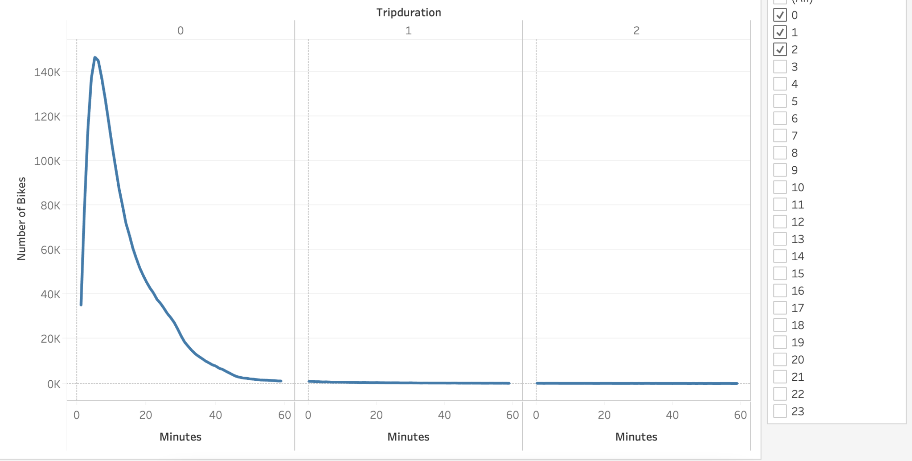
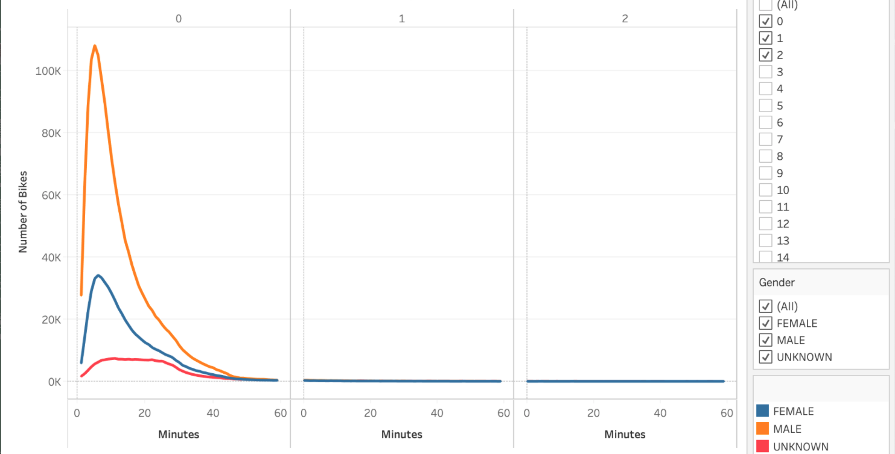
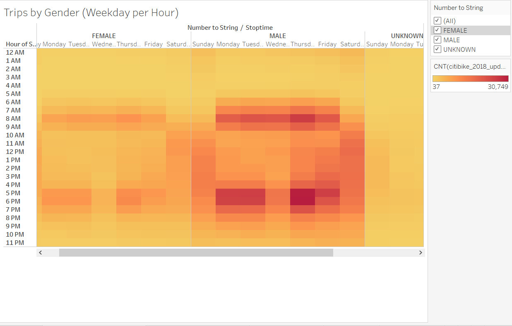
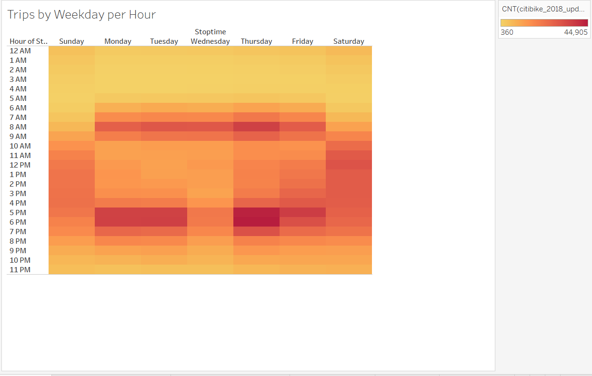
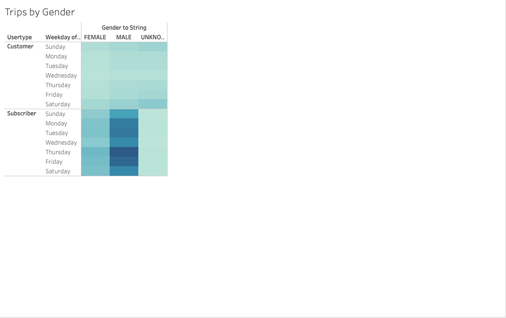
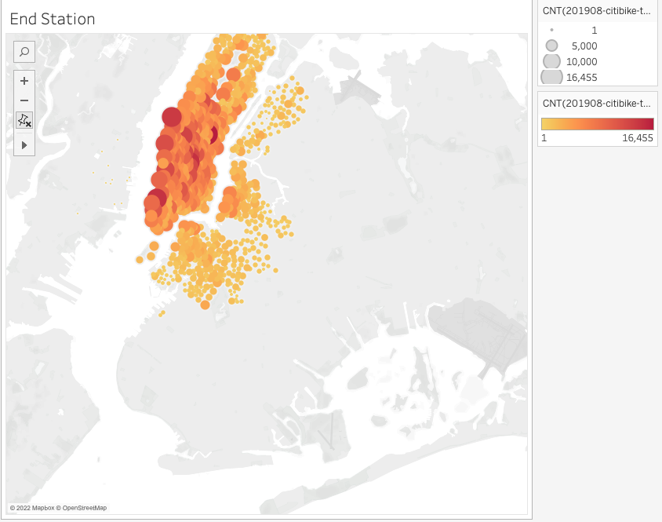
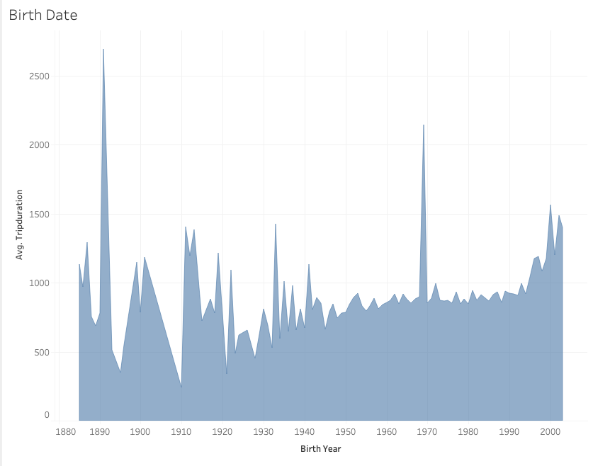
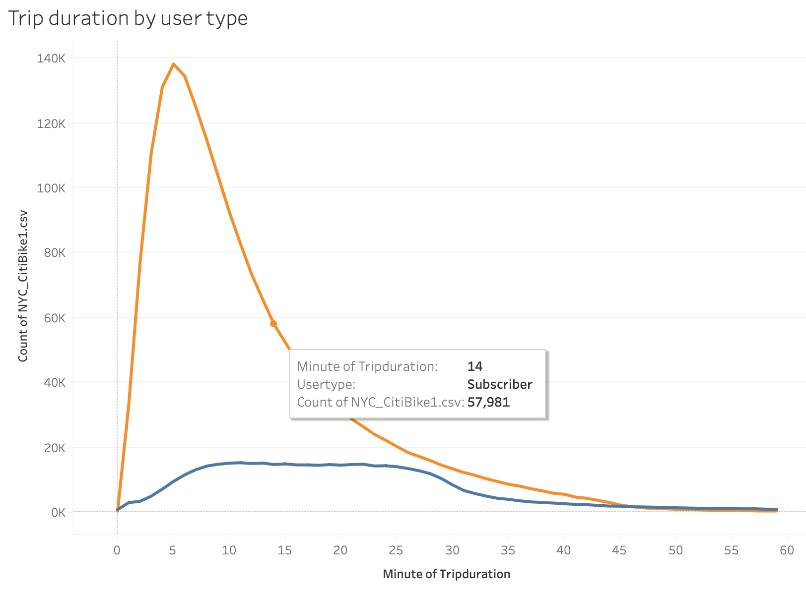
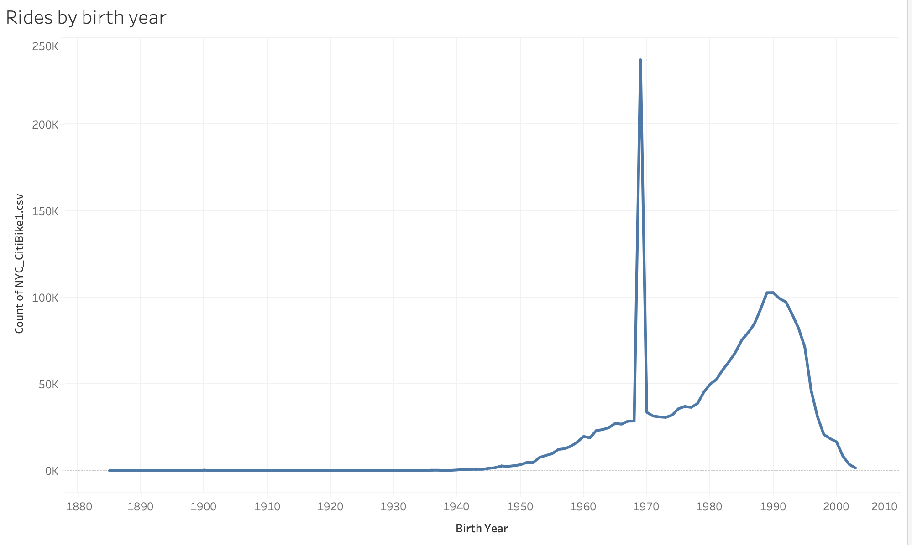

# Overview
The goal of this assignment was to persuade investors that a bike-sharing program in Des Moines is a viable business opportunity. One of the key stakeholders would like to see a bike trip analysis to help solidify the proposal so we set out to create just that.

We leveraged Pandas to convert the "tripduration" column from an integer to a datetime datatype for this analysis. Then, using the converted datatype, we created a collection of visualizations. Thos visualizations included:
1. Display the amount of time bikes are checked out for all riders and genders.
2. Display the number of bike trips made by all riders and genders during each hour of each day of the week.
3. Display the number of bike trips taken by each user type and gender on each day of the week.

## Results
We obtained these results to properly demonstrate to investors that a bike sharing business would be a good business opportunity in Des Moines.

### Checkout Time for Users
This graph depicts how long the riders typically rent the bikes for. The graph shows that there is a peak at 5 hours, indicating that most riders rent these bikes for 5 minutes, indicating that bike rentals are taken for just a short period of time.

### Checkout Times by Gender
This image depicts how long the riders typically ride their bikes for in relation to their gender. We can see that men typically rent them for the longest periods of time, about 3 times more than females.

### Trips by Gender (Weekday per Hour)
This visualization illustrates the days and times of the week when there are riders for each gender. The darker color in the chart represents the number of riders for that specific gender type at that time and day of the week. According to the chart, men are more likely than women to use bikesharing, especially during rush hour on weekdays.

### Trips by Weekday for Each Hour
This visualization portrays the days and times of the week when riders are riding. The darker color in the chart represents more riders for that particular time of week. It is clear that rush hours during the week, as well as weekends in general, see a high level of ridership. Thursdays appear to be the busiest day of the week.

### User Trips by Gender by Weekday
This chart is showing the ridership during the times of the week with respect to the gender and type of user. Again we can see that Male users who are subscribed have more ridership during the week. In general, subscribers make up the majority of riders no matter the day of the week.

### End Station
This visualization shows where riders most commonly end their ride. This is important to understanding because we will need to know rider habits and ensure all of our stations contain the proper amount of bikes.

### Birth Date
This visualization displays birth dates by users using the ride share. We can see that the majority of riders are younger. This is important because it we can compare this data with the public Des Moines data and see the average age of people in the city and see where people of particular age brackets typically live, work, and hang out.

## Summary
We can see key metrics and the potential of the bikesharing business from our visualizations and analysis. According to our study, over 2 million riders in August alone, which is the peak season. There also appear to be a lot of rides from a few specific areas, most of which are tourist attractions in the city. 

Riders typically rent the bike for more than 5 hours, with men renting them for the most prolonged periods. Furthermore, we were able to deduce that rush hours during the week and on weekends are busy and have a high volume of riders. Moreover, subscribers to bikesharing programs typically take a much greater number of rides. Men, in general, are the gender type that takes the majority of the rides.

We have discovered many important facts; however, the following two additional visualizations can be performed in the future analysis:

1. Trip duration as a function of user type (Subscriber and Customer)

2. The number of rides taken by a user in relation to their age (birth year) and gender type

This analysis has provided answers to critical questions that will persuade investors that Des Moines' bikesharing program will be a huge success. The key metrics and observations from these visualizations can be targeted to the right audience and aid in this business's successful establishment and operation.
